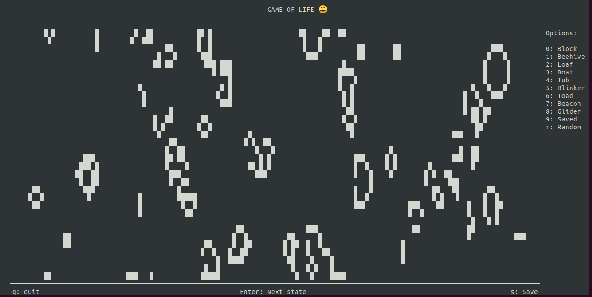

# Conway’s Game of Life

### Dependencies
* json 
* curses
* numpy

### How To Play
1. Make sure the scripts are executable.
2. Start the game by running  ```python3 main.py```
3. Choose any configuration from the right menu or press 'r' to initialize randomly.
4. Press 'Enter' key to go to next generation. 
5. You can save the state by pressing 's' and quit the game by pressing 'q'.

### Overview


